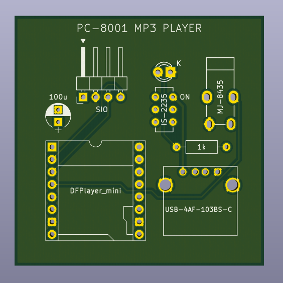
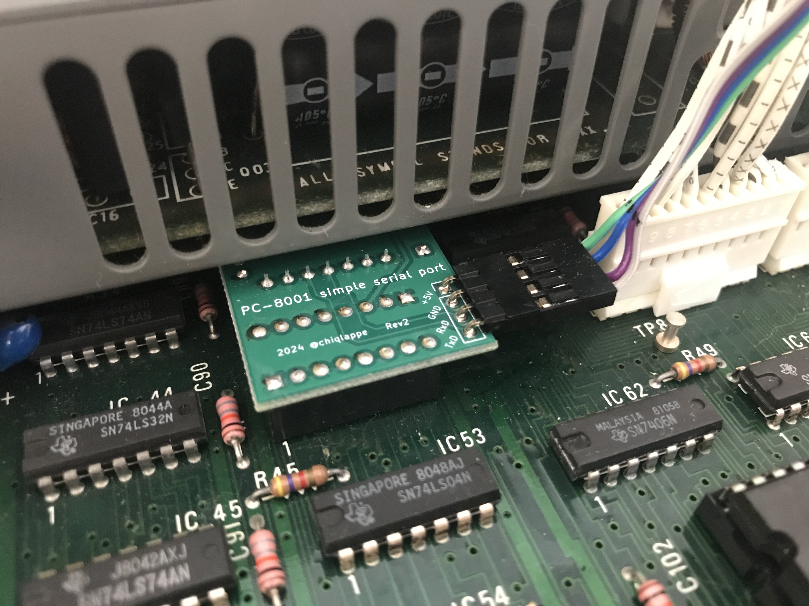
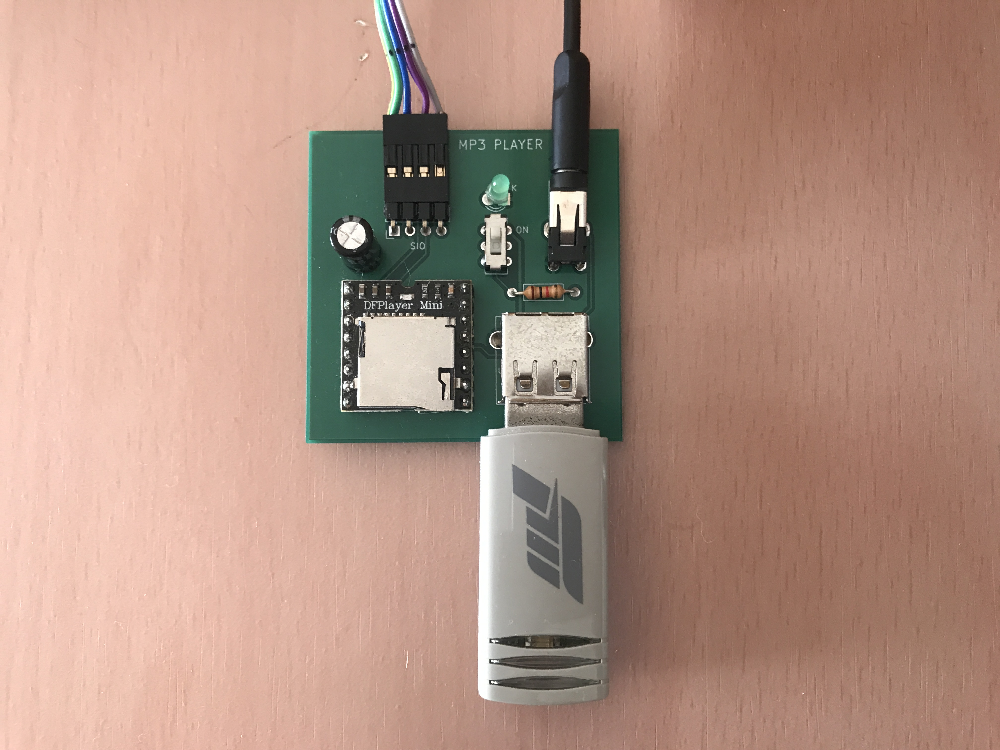

# PC-8001用 MP3プレーヤー

## 概要
- PC-8001用[シンプルシリアルポート]()からMP3プレーヤーをコントロールできます

## 部品表
|名称|値|数量|メモ|
|:-|:-|:-:|:-|
|カーボン抵抗|1KΩ|1| |
|電解コンデンサ|100u|1| |
|LED|3mm|1| |
|MP3プレーヤーモジュール|DFPlayer mini|1|[秋月電子](https://akizukidenshi.com/catalog/g/g112544/)|
|USBコネクタ|Aタイプ メス|1|[秋月電子](https://akizukidenshi.com/catalog/g/g111551/)|
|ステレオミニジャック|3.5mm|1|[秋月電子](https://akizukidenshi.com/catalog/g/g109060/)|
|スライドスイッチ|DPDT|1|[秋月電子](https://akizukidenshi.com/catalog/g/g102627/)|
|ピンヘッダ|オスL型 1x4(4p)|1| |

## 本体との接続
1. 本体の電源を切ります
2. 本体内部のジャンパを1-5にします

3. SIOソケットにシンプルシリアルポートを接続します

4. MP3プレーヤーとシンプルシリアルポートを接続ケーブルで接続します

5. MP3ファイルの入ったUSBメモリスティック、またはmicroSDカードを挿入します
6. ステレオミニジャックに外部スピーカーを接続します
7. 本体の電源を入れます
8. MP3プレーヤーのスイッチをONにします(LEDが点灯します)
9. [デモプログラム](https://github.com/chiqlappe/mp3_player/tree/main/PROGRAMS)を実行して動作を確認して下さい
   

